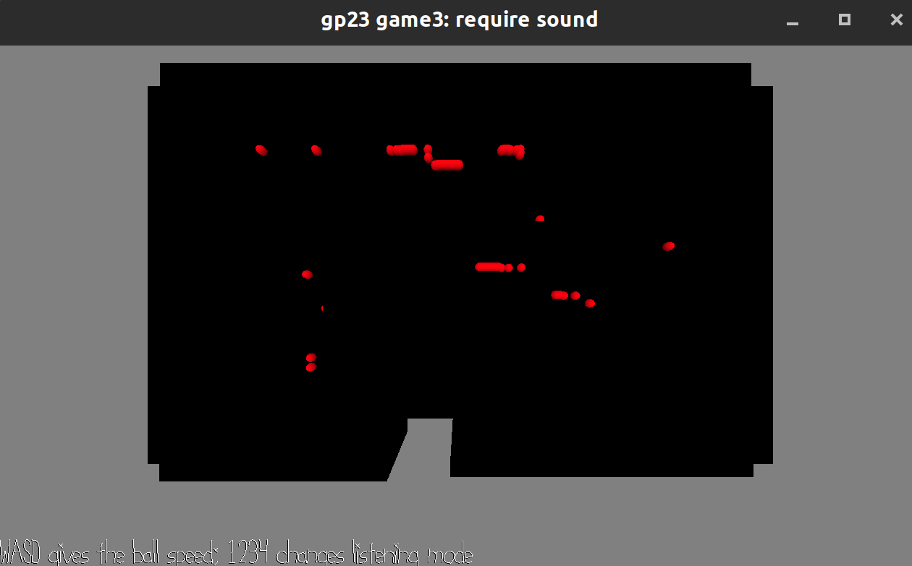

# Find the Music

Author: Yuan Meng

Design: Listen to the sound to decide which direction you are going and to decide how far you are from the music source. The original design is heavily based on the precise stereo sound effect(which does not seem to be the case). Player use 4 sound with different volume(4 direction) to make a sound represent the moving direction(and probably the location due to stereo sound). And use the stereo-sound effect and the volume to represent the distance from the music object. It turned out that, for the first degisn, the mixture of these C chord is not clear enough to tell the direction; for the second design, there is no stereo-sound effect, only the difference of left-right. I don't know if this is because I did not set the `right` parameter correctly. So basically this game is not very playable.. And each time you hit some wall you'll leave a mark there(This is trying to make the game more playble but it does not seem to have good effect.) The sound was made with the online website from the course notes.

Screen Shot:

How To Play:

WASD to give the ball some speed(No need to press to move). 1234 is changing the listening mode. 1 is 4 sound in 4 direction; 2 is 2 sound in X direction; 3 is 2sound in Y direction 4 is listening to the music object.

This game was built with [NEST](NEST.md).
